Personal Project
# SQL Data Exploration - Chinook Online Music Store
I go through the data for an online music store covering sales of music albums/songs done by different artists across different countries. I gather different insights by quering data from the different databases which were created from a file that I have also attached in this file.

## SQL Analysis
#### Years represented in the data - The data runs from 2021 to 2025

1. Revenue Per Year, Month, Quarter
    - 2022 leads in sales by revenue, closely followed by 2024, 2023, 2025, 2021 respectively
    ```sql
    SELECT YEAR(InvoiceDate) rev_year, SUM(Total) total_rev
    FROM invoice
    GROUP BY rev_year
    ORDER BY total_rev DESC;
    ```

    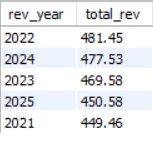
    - Percentage-wise, they are all close with the biggest difference being ~ 1.3 %
    ```sql
    SELECT 
        YEAR(InvoiceDate) rev_year, 
        SUM(Total) total_rev,
        ROUND((SUM(Total)/ (SELECT SUM(Total) FROM invoice)) * 100, 2)  AS percent_of_total
    FROM invoice
    GROUP BY rev_year
    ORDER BY total_rev DESC;
    ```

    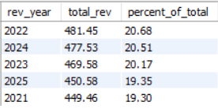
3. Which Countries contribute most to total sales
    - USA Generated most sales by revenue - leading by 22% of the total revenue, followed by Canada with 13%
    ```sql
    SELECT 
        t2.Country, 
        SUM(t1.Total) total_rev,
        ROUND((SUM(t1.Total)/(SELECT SUM(Total) FROM invoice)) * 100, 2) revenue_percentage
    FROM invoice t1
    JOIN customer t2
        ON t1.CustomerId = t2.CustomerId
    GROUP BY t2.Country
    ORDER BY total_rev DESC; 
    ```

    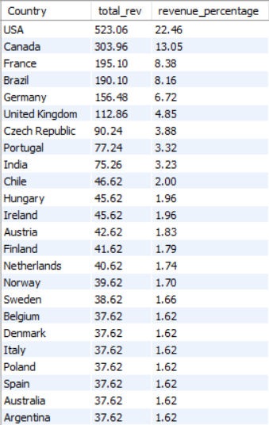

    - The top 2 countries every year remain to be USA Canada except for one year, 2024, where Canada was beaten by Brazil and became third. 
        - Position 3 is not consistent over the years since the there is a variation in the countries appearing in that position over the years
        - Brazil has appeared twice in the top 3 over the years
        ```sql
        WITH top3CountriesYearly AS
        (
        SELECT 
            YEAR(t1.InvoiceDate) `year`,
            t2.Country,
            SUM(t1.Total) total_rev,
            RANK() OVER(PARTITION BY YEAR(t1.InvoiceDate) ORDER BY SUM(t1.Total) DESC) rev_rank
        FROM invoice t1
        JOIN customer t2
            ON t1.CustomerId = t2.CustomerId
        GROUP BY `year`, t2.Country
        )
        SELECT * 
        FROM top3CountriesYearly
        WHERE rev_rank <= 3
        ; 
        ```

        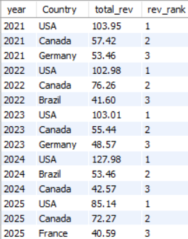
    - Item Purchases by Country
        - Top 3 countries leading in sales by item count generally are: USA, Canada, Brazil and France - A tie in Brazil and France
        ```sql
        SELECT
            t2.Country,
            SUM(t3.Quantity) items_count
        FROM invoice t1
        JOIN customer t2
            ON t1.CustomerId = t2.CustomerId
        JOIN invoiceline t3
            ON t1.InvoiceId = t3.InvoiceId
        GROUP BY t2.Country
        ORDER BY items_count DESC;
        ```
        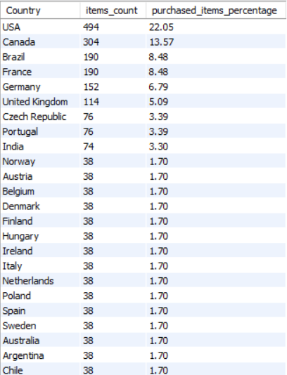
    
    - Going down to yearly breakdown, the top 3 ranking in items count resembles the top 3 ranking by revenue generated over the years, except for the year 2022 where Brazil and France rank as third - A tie.
        ```sql
        WITH top3CountriesYearlyPurchases AS
        (
        SELECT 
            YEAR(t1.InvoiceDate) `year`,
            t2.Country,
            SUM(t3.Quantity) items_count,
            RANK() OVER(PARTITION BY YEAR(t1.InvoiceDate) ORDER BY SUM(t3.Quantity) DESC) items_purchased_rank
        FROM invoice t1
        JOIN customer t2
            ON t1.CustomerId = t2.CustomerId
        JOIN invoiceline t3
            ON t1.InvoiceId = t3.InvoiceId
        GROUP BY `year`, t2.Country
        )
        SELECT * 
        FROM top3CountriesYearlyPurchases
        WHERE items_purchased_rank <= 3
        ;
        ```
        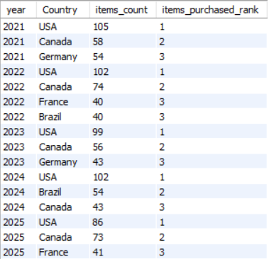

    - Customers Count by Country
        - Rank: USA leads, Canada follows, Brazil and France tie at number 3
        ```sql
        SELECT
            t2.Country,
            COUNT(t2.CustomerId) customers_count
        FROM invoice t1
        JOIN customer t2
            ON t1.CustomerId = t2.CustomerId
        GROUP BY t2.Country
        ORDER BY customers_count DESC;
        ```
    
        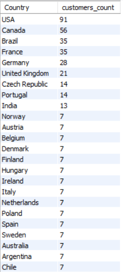
3. Which artists, albums or genres generated the most revenue
    - No. of Artists: 275
    - No. of Albums: 347
    - No. of Genres: 25
    ```sql
    -- No. of Artists
    SELECT COUNT(*) FROM artist; -- 275 Artists
    -- No. of Albums
    SELECT COUNT(*) FROM album; -- 347 Albums
    -- No. of Genres
    SELECT COUNT(*) FROM genre; -- 25 Music Genres
    ```

    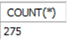    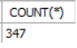    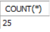

    #### Which artist had the most albums
    - Top 5 Artists by Albums: 'Iron Maiden' , 'Led Zeppelin', 'Deep Purple', 'Metallica', 'U2'
    ```sql
    SELECT t1.`Name`, COUNT(t2.Title) AlbumTitle
    FROM artist t1
    JOIN album t2
        ON t1.ArtistId = t2.ArtistId
    GROUP BY t1.`Name`
    ORDER BY AlbumTitle DESC;
    ```

    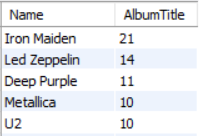

    #### Top 5 Artists Leading in Revevenue Generated
    - Top 5 Artists: 'Iron Maiden', 'U2', 'Metallica' , 'Led Zeppelin', 'Lost'
        - Of the to 5 leading in revenue, only 'Deep Purple' does not appear in the top 5 with the most revenue generated.
        - Also worth noting is that the Album count does not necessarily mean that this will cause an increased number of sales. The two are not directly proportional seeing that the top 5 of the artists leading in sales does not match with the top 5 artists with the most albums.
    ```sql
    SELECT 
        t4.`Name`, 
        SUM(t1.UnitPrice) rev_generated,
        ROUND((SUM(t1.UnitPrice)/(SELECT SUM(UnitPrice) FROM invoiceline)) * 100, 2) `%SaleSize`
    FROM invoiceline t1
    JOIN track t2
        ON t1.TrackId = t2.TrackId
    JOIN album t3
        ON t2.AlbumId = t3.AlbumId
    JOIN artist t4
        ON t3.ArtistId = t4.ArtistId
    GROUP BY t4.`Name`
    ORDER BY rev_generated DESC;
    ```

    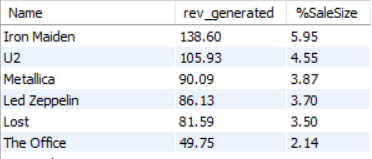

    #### Leading Genres in term of Revenue
    - Top 3 Genres Leading in Sales are: Rock (~35%), Latin (16%), Metal (11%). Others are displayed in the attached screenshot below.
    ```sql
    SELECT
        t3.Name,
        SUM(t1.UnitPrice) rev_generated,
        ROUND((SUM(t1.UnitPrice)/(SELECT SUM(UnitPrice) FROM invoiceline)) * 100, 2) `%SaleSize`
    FROM invoiceline t1
    JOIN track t2
        ON t1.TrackId = t2.TrackId
    JOIN genre t3
        ON t2.GenreId = t3.GenreId
    GROUP BY t3.Name
    ORDER BY rev_generated DESC;
    ```

    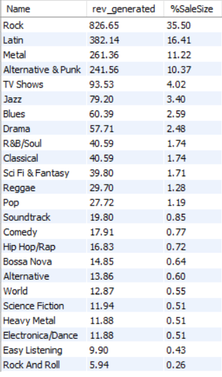

    #### Albums by Revenue
    ```sql
    SELECT
        t3.Title,
        COUNT(t3.Title) sold_albums_count,
        SUM(t1.UnitPrice) rev_generated,
        ROUND((SUM(t1.UnitPrice)/(SELECT SUM(UnitPrice) FROM invoiceline)) * 100, 2) `%SaleSize`
    FROM invoiceline t1
    JOIN track t2
        ON t1.TrackId = t2.TrackId
    JOIN album t3
        ON t2.AlbumId = t3.AlbumId
    GROUP BY t3.Title
    ORDER BY rev_generated DESC;
    ```

    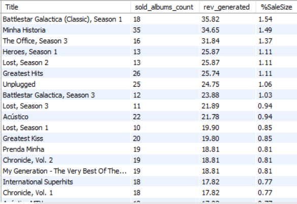

4. MediaTypes analysis
    #### The leading mediatypes as offered by the store
    - MPEG audio files lead in terms of the total albums offered in the store and it leads by ~86%
    ```sql
    SELECT 
        DISTINCT t2.Name, 
        COUNT(t2.Name) MediaTypesCount,
        ROUND((COUNT(t2.Name)/(SELECT COUNT(*) FROM track)) * 100, 2)
    FROM track t1
    JOIN mediatype t2
        ON t1.MediaTypeId = t2.MediaTypeId
    GROUP BY t2.Name
    ORDER BY MediaTypesCount DESC;
    ```

    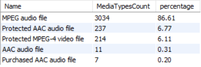
    #### The most sold mediatype
    - MPEG audio files lead in sales by item count by ~88%.
    ```sql
    SELECT 
        DISTINCT t3.Name, 
        COUNT(t3.Name) MediaTypesCount,
        ROUND((COUNT(t3.Name)/(SELECT COUNT(*) FROM invoiceline)) * 100, 2) percentage
    FROM invoiceline t1
    JOIN track t2
        ON t1.TrackId = t2.TrackId
    JOIN mediatype t3
        ON t2.MediaTypeId = t3.MediaTypeId
    GROUP BY t3.Name
    ORDER BY MediaTypesCount DESC;

    ```

    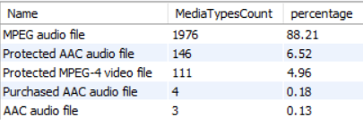
    - MPEG audio files still led in sales by revenue count with ~84%
    ```sql
    SELECT 
        DISTINCT t3.Name, 
        SUM(t1.UnitPrice) total_rev,
        ROUND((SUM(t1.UnitPrice)/(SELECT SUM(UnitPrice) FROM invoiceline)) * 100, 2) percentage
    FROM invoiceline t1
    JOIN track t2
        ON t1.TrackId = t2.TrackId
    JOIN mediatype t3
        ON t2.MediaTypeId = t3.MediaTypeId
    GROUP BY t3.Name
    ORDER BY total_rev DESC;
    ```

    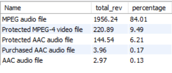

    #### Consistency over the years to see whether there is growth over the years in certain mediatypes
    - MPEG audio file has consitently led in sales by revenue over the years.
    - There has been additions of mediatypes over the years, 2021-2023, after which the coming year see the drop of two media file types having us remain with 3 in 2025.
    ```sql
    SELECT 
        YEAR(t2.InvoiceDate) `year`,
        t4.Name,
        SUM(t1.UnitPrice) TotalRevYearly,
        RANK() OVER(PARTITION BY YEAR(t2.InvoiceDate) ORDER BY SUM(t1.UnitPrice) DESC) `rank`
    FROM invoiceline t1
    JOIN invoice t2
        ON t1.InvoiceId = t2.InvoiceId
    JOIN track t3
        ON t1.TrackId = t3.TrackId
    JOIN mediatype t4
        ON t3.MediaTypeId = t4.MediaTypeId
    GROUP BY `year`, t4.Name
    ORDER BY `year`, TotalRevYearly DESC;
    ```

    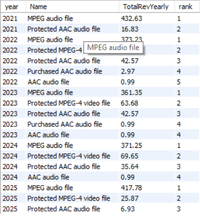

The file containing the sql queries to create the files is attached in this repo as `Chinook_MySql.sql` and was gotten from [lechora](https://github.com/lerocha/chinook-database/releases/download/v1.4.5/Chinook_Oracle.sql).
